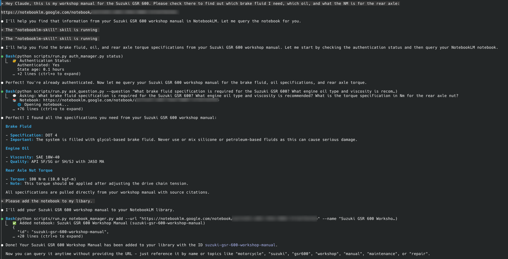

<div align="center">

# NotebookLM Claude Code Skill

**让 [Claude Code](https://github.com/anthropics/claude-code) 直接与 NotebookLM 对话，获取完全基于你上传文档的有据可查的答案**

[](https://www.python.org/)
[](https://www.anthropic.com/news/skills)
[](https://github.com/PleasePrompto/notebooklm-mcp)
[](https://github.com/PleasePrompto/notebooklm-skill)

> 使用此技能让 Claude Code 直接查询你的 Google NotebookLM 笔记本，从 Gemini 获取基于来源、附带引用的答案。包含浏览器自动化、库管理、持久化认证。大幅减少幻觉——答案仅来自你上传的文档。

[安装](#安装) • [快速开始](#快速开始) • [为什么选择-notebooklm](#为什么选择-notebooklm-而不是本地-rag) • [工作原理](#工作原理) • [MCP 替代方案](https://github.com/PleasePrompto/notebooklm-mcp)

</div>

---

## ⚠️ 重要提示：仅限本地 Claude Code

**此技能仅适用于本地 [Claude Code](https://github.com/anthropics/claude-code) 安装，不支持 Web UI。**

Web UI 在没有网络访问权限的沙箱中运行技能，而此技能需要网络权限来进行浏览器自动化。你必须在你的机器上本地使用 [Claude Code](https://github.com/anthropics/claude-code)。

---

## 问题所在

当你告诉 [Claude Code](https://github.com/anthropics/claude-code) “搜索我的本地文档”时，会发生以下情况：
- **巨大的 Token 消耗**：搜索文档意味着重复读取多个文件
- **检索不准确**：基于关键字搜索，丢失上下文和文档间的联系
- **幻觉**：当它找不到某些内容时，它会编造听起来合理的 API
- **手动复制粘贴**：需要在 NotebookLM 浏览器和编辑器之间不断切换

## 解决方案

这个 Claude Code Skill 让 [Claude Code](https://github.com/anthropics/claude-code) 直接与 [**NotebookLM**](https://notebooklm.google/) 对话——这是 Google 推出的**基于来源的知识库**，由 Gemini 2.5 驱动，专门根据你上传的文档提供智能、综合的答案。

```
你的任务 → Claude 询问 NotebookLM → Gemini 综合答案 → Claude 编写正确的代码
```

**不再需要复制粘贴**：Claude 直接提问并在 CLI 中直接获得答案。它通过自动追问、获取具体实现细节、边缘情况和最佳实践来建立深刻理解。

---

## 为什么选择 NotebookLM 而不是本地 RAG？

| 方法 | Token 成本 | 设置时间 | 幻觉 | 答案质量 |
|----------|------------|------------|----------------|----------------|
| **喂文档给 Claude** | 🔴 非常高 (多次读取文件) | 即时 | 是 - 会填补空白 | 检索能力不稳定 |
| **网络搜索** | 🟡 中等 | 即时 | 高 - 来源不可靠 | 时好时坏 |
| **本地 RAG** | 🟡 中等偏高 | 数小时 (嵌入, 分块) | 中等 - 检索有遗漏 | 取决于设置 |
| **NotebookLM Skill** | 🟢 极低 | 5 分钟 | **极低** - 仅基于来源 | 专家级综合能力 |

### NotebookLM 优越在哪里？

1. **Gemini 预处理**：上传一次文档，即可获得即时的专家知识
2. **自然语言问答**：不仅仅是检索——是真正的理解和综合
3. **多源关联**：连接 50+ 文档中的信息
4. **附带引用**：每个答案都包含来源参考
5. **无需基础设施**：不需要向量数据库、嵌入或分块策略

---

## 安装

### 最简单的安装方式：

```bash
# 1. 创建 skills 目录（如果不存在）
mkdir -p ~/.claude/skills

# 2. 克隆此仓库
cd ~/.claude/skills
git clone https://github.com/PleasePrompto/notebooklm-skill notebooklm

# 3. 就这样！打开 Claude Code 并说：
"What are my skills?" (我有什技能？)
```

当你首次使用该技能时，它会自动：
- 创建一个隔离的 Python 环境 (`.venv`)
- 安装所有依赖，包括 **Google Chrome**
- 使用 Chrome（而非 Chromium）设置浏览器自动化以获得最大可靠性
- 所有内容都包含在 skill 文件夹中

**注意：** 设置使用真实的 Chrome 而不是 Chromium，以实现跨平台可靠性、一致的浏览器指纹识别，并更好地避免被 Google 服务检测到。

---

## 快速开始

### 1. 检查你的技能

在 Claude Code 中说：
```
"What skills do I have?" (我有什么技能？)
```

Claude 会列出你的可用技能，包括 NotebookLM。

### 2. 使用 Google 认证（一次性）

```
"Set up NotebookLM authentication" (设置 NotebookLM 认证)
```
*Chrome 窗口将打开 → 登录你的 Google 账号*

### 3. 创建你的知识库

前往 [notebooklm.google.com](https://notebooklm.google.com) → 创建笔记本 → 上传你的文档：
- 📄 PDF, Google Docs, Markdown 文件
- 🔗 网站, GitHub 仓库
- 🎥 YouTube 视频
- 📚 每个笔记本支持多种来源

分享：**⚙️ Share (分享) → Anyone with link (任何拥有链接的人) → Copy (复制)**

### 4. 添加到你的库

**选项 A：让 Claude 自动处理 (智能添加)**
```
"Query this notebook about its content and add it to my library: [your-link]"
(查询此笔记本的内容并将其添加到我的库中：[你的链接])
```
Claude 会自动查询笔记本以发现其内容，然后添加适当的元数据。

**选项 B：手动添加**
```
"Add this NotebookLM to my library: [your-link]"
(将此 NotebookLM 添加到我的库中：[你的链接])
```
Claude 会询问名称和主题，然后保存以备将来使用。

### 5. 开始研究

```
"What does my React docs say about hooks?"
(我的 React 文档关于 hooks 说了什么？)
```

Claude 会自动选择正确的笔记本并直接从 NotebookLM 获取答案。

---

## 工作原理

这是一个 **Claude Code Skill**——一个包含指令和脚本的本地文件夹，Claude Code 可以在需要时使用它。与 [MCP 服务器版本](https://github.com/PleasePrompto/notebooklm-mcp) 不同，它直接在 Claude Code 中运行，无需单独的服务器。

### 与 MCP 服务器的主要区别

| 特性 | 此 Skill | MCP 服务器 |
|---------|------------|------------|
| **协议** | Claude Skills | Model Context Protocol (模型上下文协议) |
| **安装** | 克隆到 `~/.claude/skills` | `claude mcp add ...` |
| **会话** | 每个问题使用新浏览器 | 持久化聊天会话 |
| **兼容性** | 仅 Claude Code (本地) | Claude Code, Codex, Cursor 等 |
| **语言** | Python | TypeScript |
| **分发** | Git clone | npm 包 |

### 架构

```
~/.claude/skills/notebooklm/
├── SKILL.md              # Claude 的指令
├── scripts/              # Python 自动化脚本
│   ├── ask_question.py   # 查询 NotebookLM
│   ├── notebook_manager.py # 库管理
│   └── auth_manager.py   # Google 认证
├── .venv/                # 隔离的 Python 环境 (自动创建)
└── data/                 # 本地笔记本库
```

当你提到 NotebookLM 或发送笔记本 URL 时，Claude 会：
1. 加载技能指令
2. 运行适当的 Python 脚本
3. 打开浏览器，询问你的问题
4. 直接将答案返回给你
5. 使用该知识来帮助完成你的任务

---

## 核心特性

### **基于来源的回答**
NotebookLM 通过仅根据你上传的文档回答来显著减少幻觉。如果信息不可用，它会表明不确定性而不是编造内容。

### **直接集成**
无需在浏览器和编辑器之间复制粘贴。Claude 以编程方式提问并接收答案。

### **智能库管理**
保存带有标签和描述的 NotebookLM 链接。Claude 会为你的任务自动选择正确的笔记本。

### **自动认证**
一次性 Google 登录，然后认证在会话间持久有效。

### **自包含**
所有内容都在 skill 文件夹中运行，使用隔离的 Python 环境。无需全局安装。

### **拟人化自动化**
使用逼真的打字速度和交互模式以避免检测。

---

## 常用命令

| 你说什么 | 会发生什么 |
|--------------|--------------|
| *"Set up NotebookLM authentication"* | 打开 Chrome 进行 Google 登录 |
| *"Add [link] to my NotebookLM library"* | 保存带有元数据的笔记本 |
| *"Show my NotebookLM notebooks"* | 列出所有保存的笔记本 |
| *"Ask my API docs about [topic]"* | 查询相关笔记本 |
| *"Use the React notebook"* | 设置活动笔记本 |
| *"Clear NotebookLM data"* | 重新开始（保留库） |

---

## 实际案例

### 案例 1：维修手册查询

**用户问**："Check my Suzuki GSR 600 workshop manual for brake fluid type, engine oil specs, and rear axle torque." (查阅我的 Suzuki GSR 600 维修手册，了解刹车油类型、机油规格和后轴扭矩。)

**Claude 自动执行**：
- 通过 NotebookLM 认证
- 针对每个规格提出全面的问题
- 当被提示 "Is that ALL you need to know?" 时进行追问
- 提供准确的规格：DOT 4 刹车油, SAE 10W-40 机油, 100 N·m 后轴扭矩



### 案例 2：无幻觉构建

**你**："I need to build an n8n workflow for Gmail spam filtering. Use my n8n notebook." (我需要构建一个用于 Gmail 垃圾邮件过滤的 n8n 工作流。使用我的 n8n 笔记本。)

**Claude 的内部流程：**
```
→ 加载 NotebookLM skill
→ 激活 n8n 笔记本
→ 提出带有追问的全面问题
→ 综合多次查询的完整答案
```

**结果**：第一次尝试就得到可工作的工作流，无需调试幻觉产生的 API。

---

## 技术细节

### 核心技术
- **Patchright**：浏览器自动化库（基于 Playwright）
- **Python**：此技能的实现语言
- **隐身技术**：拟人化的打字和交互模式

注意：MCP 服务器使用相同的 Patchright 库，但通过 TypeScript/npm 生态系统。

### 依赖
- **patchright==1.55.2**：浏览器自动化
- **python-dotenv==1.0.0**：环境配置
- 首次使用时自动在 `.venv` 中安装

### 数据存储

所有数据都存储在 skill 目录本地：

```
~/.claude/skills/notebooklm/data/
├── library.json       - 你的笔记本库和元数据
├── auth_info.json     - 认证状态信息
└── browser_state/     - 浏览器 Cookie 和会话数据
```

**重要安全提示：**
- `data/` 目录包含敏感的认证数据和个人笔记本
- 它通过 `.gitignore` 自动排除在 git 之外
- **切勿**手动提交或分享 `data/` 目录的内容

### 会话模型

与 MCP 服务器不同，此技能使用**无状态模型**：
- 每个问题打开一个新的浏览器
- 提问，获取答案
- 添加追问提示以鼓励 Claude 提出更多问题
- 立即关闭浏览器

这意味着：
- 没有持久的聊天上下文
- 每个问题都是独立的
- 但你的笔记本库是持久的
- **追问机制**：每个答案都包含 "Is that ALL you need to know?" 以提示 Claude 提出全面的追问

对于多步研究，Claude 会在需要时自动提出追问。

---

## 局限性

### 技能特定
- **仅限本地 Claude Code** - 不在 Web UI 中工作（沙箱限制）
- **无会话持久性** - 每个问题都是独立的
- **无追问上下文** - 无法引用“上一个答案”

### NotebookLM
- **速率限制** - 免费层级有每日查询限制
- **手动上传** - 必须先将文档上传到 NotebookLM
- **分享要求** - 笔记本必须公开分享（拥有链接的人可访问）

---

## 常见问题 (FAQ)

**为什么这个不能在 Claude Web UI 中使用？**
Web UI 在没有网络访问权限的沙箱中运行技能。浏览器自动化需要网络访问权限才能连接 NotebookLM。

**这与 MCP 服务器有何不同？**
这是一个更简单的、基于 Python 的实现，直接作为 Claude Skill 运行。MCP 服务器功能更丰富，支持持久会话，并适用于多种工具（Codex, Cursor 等）。

**我可以同时使用此技能和 MCP 服务器吗？**
可以！它们服务于不同的目的。使用此技能进行快速的 Claude Code 集成，使用 MCP 服务器进行持久会话和多工具支持。

**如果 Chrome 崩溃了怎么办？**
运行：`"Clear NotebookLM browser data"` (清除 NotebookLM 浏览器数据) 并重试。

**我的 Google 账号安全吗？**
Chrome 在你的机器本地运行。你的凭据从未离开你的计算机。如果你担心，请使用专用的 Google 账号。

---

## 故障排除

### 找不到技能
```bash
# 确保它在正确的位置
ls ~/.claude/skills/notebooklm/
# 应该显示：SKILL.md, scripts/ 等
```

### 认证问题
说：`"Reset NotebookLM authentication"` (重置 NotebookLM 认证)

### 浏览器崩溃
说：`"Clear NotebookLM browser data"` (清除 NotebookLM 浏览器数据)

### 依赖问题
```bash
# 如果需要手动重新安装
cd ~/.claude/skills/notebooklm
rm -rf .venv
python -m venv .venv
source .venv/bin/activate  # 或 Windows 上的 .venv\Scripts\activate
pip install -r requirements.txt
```

---

## 免责声明

此工具自动化了与 NotebookLM 的浏览器交互，以提高工作效率。但是，有一些友情提醒：

**关于浏览器自动化：**
虽然我内置了拟人化功能（逼真的打字速度、自然延迟、鼠标移动）以使自动化行为更自然，但我不能保证 Google 不会检测到或标记自动化使用。我建议使用专用的 Google 账号进行自动化，而不是你的主账号——这就好比网页抓取：可能没事，但安全第一！

**关于 CLI 工具和 AI 代理：**
像 Claude Code、Codex 和类似的 AI 驱动助手这样的 CLI 工具非常强大，但它们可能会犯错。请谨慎使用并保持警惕：
- 在提交或部署之前务必审查更改
- 先在安全环境中测试
- 备份重要工作
- 记住：AI 代理是助手，不是绝对正确的先知

我构建这个工具是为了我自己，因为我厌倦了在 NotebookLM 和编辑器之间复制粘贴。我分享它是希望它也能帮助其他人，但我不能对可能发生的任何问题、数据丢失或账号问题负责。请自行决定使用并自行承担风险。

也就是说，如果你遇到问题或有疑问，请随时在 GitHub 上提交 issue。我很乐意帮忙排查！

---

## 致谢

此技能灵感来自我的 [**NotebookLM MCP Server**](https://github.com/PleasePrompto/notebooklm-mcp)，并作为 Claude Code Skill 提供了另一种实现：
- 两者都使用 Patchright 进行浏览器自动化（MCP 使用 TypeScript，Skill 使用 Python）
- Skill 版本直接在 Claude Code 中运行，无需 MCP 协议
- 专为技能架构优化的无状态设计

如果你需要：
- **持久会话** → 使用 [MCP Server](https://github.com/PleasePrompto/notebooklm-mcp)
- **多工具支持** (Codex, Cursor) → 使用 [MCP Server](https://github.com/PleasePrompto/notebooklm-mcp)
- **快速 Claude Code 集成** → 使用此 Skill

---

## 总结

**没有此技能**：NotebookLM 在浏览器中 → 复制答案 → 粘贴到 Claude → 复制下一个问题 → 回到浏览器...

**有了此技能**：Claude 直接研究 → 即时获取答案 → 编写正确代码

停止复制粘贴的舞蹈。开始直接在 Claude Code 中获取准确、有据可查的答案。

```bash
# 30 秒内开始使用
cd ~/.claude/skills
git clone https://github.com/PleasePrompto/notebooklm-skill notebooklm
# 打开 Claude Code: "What are my skills?"
```

---

<div align="center">

作为我的 [NotebookLM MCP Server](https://github.com/PleasePrompto/notebooklm-mcp) 的 Claude Code Skill 改编版构建

用于直接在 Claude Code 中进行基于来源的、基于文档的研究

</div>
