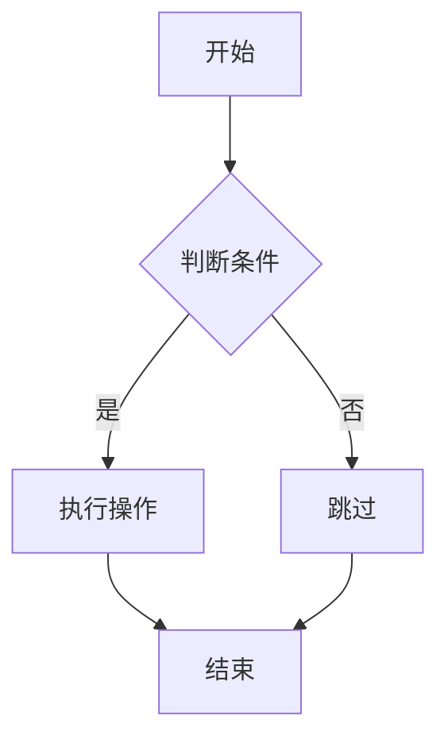

# Tech Article Polisher - 使用示例

## 基础用法

### 单文件润色

**用户请求：**
```
请润色 /Users/huangchenning/个人/WeChat/Oracle view/第 06 篇.md
```

**执行步骤：**
1. 读取目标文件内容
2. 分析文章结构和技术内容
3. 应用适当的文学手法
4. 添加微信公众号格式
5. 生成 5 个备选标题
6. 输出润色后的文章

**输出格式：**
```markdown
## 润色后的文章

[完整的润色内容]

---

## 备选标题

1. [标题1]
2. [标题2]
3. [标题3]
4. [标题4]
5. [标题5]
```

### 批量润色

**用户请求：**
```
请润色 /Users/huangchenning/个人/WeChat/Oracle view/ 目录下所有的 md 文件，除了第 01 篇、第 02 篇、第 03 篇
```

**执行步骤：**
1. 列出目录下所有 .md 文件
2. 过滤掉排除的文件
3. 为每个文件创建待办事项
4. 逐个处理文件
5. 更新进度
6. 完成后输出总结

**输出格式：**
```markdown
## 润色进度

✅ 第 04 篇：[标题] - 已完成
✅ 第 05 篇：[标题] - 已完成
...
✅ 第 22 篇：[标题] - 已完成

## 总结

共润色 19 篇文章，所有文章已保存到原目录。
```

## 多技术领域示例

### MySQL 文章润色

**用户请求：**
```
请润色 /path/to/mysql-performance.md，这是一篇关于 MySQL 性能优化的文章
```

**润色示例：**

**原文：**
```markdown
# MySQL 性能优化

MySQL 是一个流行的关系型数据库管理系统。在处理大量数据时，性能优化非常重要。

## 慢查询日志

慢查询日志可以帮助我们找到执行时间长的 SQL 语句。
```

**润色后：**
```markdown
# MySQL 性能优化：从慢查询到极速响应

MySQL 就像一位经验丰富的图书管理员——管理着成千上万本书（数据），但如何让读者（用户）快速找到想要的书籍，却是一门艺术。

## 慢查询日志：性能问题的照妖镜

慢查询日志就像一面照妖镜，照出了那些潜伏在数据库深处的"慢动作"SQL。一条查询执行了 10 秒，但 CPU 使用率只有 5%——问题出在哪里？答案可能藏在执行计划里。

```sql
-- 适用版本：MySQL 5.7 / 8.0
-- 启用慢查询日志
SET GLOBAL slow_query_log = 'ON';
SET GLOBAL long_query_time = 2;
```

---

## 备选标题

1. MySQL 性能优化：三招让你的查询快如闪电
2. 从慢查询到极速响应：MySQL 性能调优实战指南
3. 为什么你的 MySQL 慢如蜗牛？答案藏在慢查询日志里
4. MySQL 性能优化：三个视图、五步排查、十种技巧
5. 掌握这些 MySQL 优化技巧，你就是性能专家
```

### Kubernetes 文章润色

**用户请求：**
```
请润色 /path/to/k8s-deployment.md，这是一篇关于 Kubernetes 部署的文章
```

**润色示例：**

**原文：**
```markdown
# Kubernetes 部署指南

Kubernetes 是一个容器编排平台。Deployment 是 Kubernetes 中用于管理 Pod 的资源对象。

## 创建 Deployment

使用 kubectl 命令创建 Deployment。
```

**润色后：**
```markdown
# Kubernetes 部署指南：从零到一的容器编排之旅

Kubernetes 就像一支现代化的军队——指挥官（Deployment）发布命令，士兵（Pod）自动执行，伤亡了自动补充。你不再需要手动管理每一个容器，而是通过声明式配置，让系统自动完成繁重的工作。

## Deployment：自动化的军队指挥官

Deployment 就像一位精明的指挥官，它不仅负责部署 Pod，还负责监控 Pod 的健康状态。当 Pod 崩溃时，Deployment 会自动创建新的 Pod；当需要更新应用时，Deployment 会采用滚动更新策略，确保服务不中断。

```yaml
# 适用版本：Kubernetes 1.20+
apiVersion: apps/v1
kind: Deployment
metadata:
  name: my-app
spec:
  replicas: 3
  selector:
    matchLabels:
      app: my-app
  template:
    metadata:
      labels:
        app: my-app
    spec:
      containers:
      - name: my-app
        image: my-app:1.0
        ports:
        - containerPort: 8080
```

---

## 备选标题

1. Kubernetes 部署指南：三步让你的应用上云
2. 从零到一：Kubernetes 容器编排实战指南
3. 为什么你的容器总是崩溃？Deployment 自动扩容来帮忙
4. Kubernetes 部署：三个资源、五步部署、十种监控
5. 掌握这些 K8s 技巧，你就是云原生工程师
```

### LLM/Prompt Engineering 文章润色

**用户请求：**
```
请润色 /path/to/prompt-engineering.md，这是一篇关于 Prompt Engineering 的文章
```

**润色示例：**

**原文：**
```markdown
# Prompt Engineering 入门

Prompt Engineering 是一种优化大语言模型输出的技术。通过设计合适的提示词，可以让模型生成更好的回答。

## Temperature 参数

Temperature 参数控制模型输出的随机性。
```

**润色后：**
```markdown
# Prompt Engineering 入门：让 AI 听懂你的话

Prompt 就像给 AI 的指令书——写得越清楚，AI 执行得越准确。但为什么同一个 Prompt，有时回答精准，有时胡言乱语？答案藏在 Temperature 参数里。

## Temperature：创造性与准确性的平衡艺术

Temperature 就像 AI 的"性格调节器"——设置为 0 时，AI 变得严谨刻板，每次回答都一模一样；设置为 1 时，AI 变得天马行空，每次回答都充满惊喜。找到合适的 Temperature，就像找到完美的咖啡温度，需要不断尝试和调整。

```python
# 适用版本：Python 3.8+ / OpenAI API v1.0+
response = client.chat.completions.create(
    model="gpt-4",
    messages=[
        {"role": "system", "content": "You are a helpful assistant."},
        {"role": "user", "content": "解释什么是 Prompt Engineering"}
    ],
    temperature=0.7  # 在创造性和准确性之间找到平衡
)
```

---

## 备选标题

1. Prompt Engineering 入门：三招让你的 AI 回答更精准
2. 从胡言乱语到精准回答：Prompt Engineering 实战指南
3. 为什么同一个 Prompt 效果不同？答案藏在 Temperature 里
4. Prompt Engineering：三个参数、五步优化、十种技巧
5. 掌握这些 Prompt 技巧，你就是 AI 工程师
```

### Mermaid 图表文章润色

**用户请求：**
```
请润色 /path/to/mermaid-guide.md，这是一篇关于 Mermaid 图表的文章
```

**润色示例：**

**原文：**
```markdown
# Mermaid 图表教程

Mermaid 是一个用于创建图表的工具。它支持流程图、时序图等多种图表类型。

## 流程图

流程图用于表示流程和步骤。
```

**润色后：**
```markdown
# Mermaid 图表教程：用代码画出你的想法

Mermaid 就像一位会画图的程序员——你用代码描述想法，它用图表呈现结果。不再需要复杂的绘图工具，只需几行代码，就能画出专业的流程图、时序图、架构图。

## 流程图：让逻辑可视化

流程图就像一张地图，指引读者从起点走到终点。通过节点和箭头的组合，复杂的逻辑变得一目了然。为什么文字描述总是让人困惑？因为人类的大脑更喜欢图像。



---

## 备选标题

1. Mermaid 图表教程：三步让你的文档更专业
2. 从文字到图表：Mermaid 可视化实战指南
3. 为什么你的文档总是看不懂？Mermaid 图表来帮忙
4. Mermaid 图表：三种类型、五步绘制、十种技巧
5. 掌握这些 Mermaid 技巧，你就是文档专家
```

## 高级用法

### 指定润色强度

**用户请求：**
```
请轻度润色这篇文章，只添加必要的格式和标题，不要过度使用文学手法
```

**执行策略：**
- 仅使用 2-3 种文学手法
- 保持原文风格
- 只添加基本的微信公众号格式
- 生成 3 个备选标题

### 指定文学手法

**用户请求：**
```
请使用金庸式笔触和物化手法润色这篇文章
```

**执行策略：**
- 优先使用指定的文学手法
- 在适当场景下应用
- 确保手法自然融入
- 不强行使用

### 技术内容验证

**用户请求：**
```
请润色这篇文章，并验证所有代码片段的技术准确性
```

**执行策略：**
1. 润色文章内容
2. 提取所有代码片段
3. 验证语法正确性
4. 检查 API 名称和参数
5. 确认版本兼容性
6. 输出验证报告

**验证报告格式：**
```markdown
## 技术准确性验证

✅ SQL 脚本 1：语法正确，适用于 Oracle 11g/12c/19c/26ai
✅ Python 代码 1：语法正确，适用于 Python 3.8+
✅ YAML 配置 1：语法正确，适用于 Kubernetes 1.20+
⚠️ API 调用 1：参数名可能已过时，建议验证
```

## 错误处理

### 文件读取失败

**场景：** 目标文件不存在或无法读取

**处理方式：**
```markdown
## 错误

无法读取文件：/path/to/file.md

可能原因：
1. 文件不存在
2. 文件权限不足
3. 文件路径错误

建议：
1. 检查文件路径是否正确
2. 确认文件是否存在
3. 检查文件权限
```

### 技术内容验证失败

**场景：** 代码片段存在语法错误

**处理方式：**
```markdown
## 警告

发现技术内容问题：

**SQL 脚本 3（第 45 行）：**
```sql
SELECT * FROM v$session WHERE status = 'ACTIVE'
```

问题：缺少分号

建议修复：
```sql
SELECT * FROM v$session WHERE status = 'ACTIVE';
```

是否继续润色？建议先修复技术问题。
```

### 技术领域检测失败

**场景：** 无法自动识别文章的技术领域

**处理方式：**
```markdown
## 提示

无法自动识别文章的技术领域。

请指定技术领域，例如：
- 这是一篇关于 MySQL 的文章
- 这是一篇关于 Kubernetes 的文章
- 这是一篇关于 Prompt Engineering 的文章
- 这是一篇关于 Mermaid 的文章

指定技术领域后，我将使用更精准的术语和示例进行润色。
```

## 输出文件规范

### 文件命名

- 临时文件：`/Users/huangchenning/个人/WeChat/article{序号}_polished.md`
- 最终文件：替换原文件或使用新文件名

### 文件编码

- 使用 UTF-8 编码
- 支持中文字符
- 保留原始换行符

### 格式标准

- 使用 Markdown 格式
- 标题层级：# > ## > ###
- 代码块使用 ```sql、```python、```yaml、```bash 等
- 表格使用标准 Markdown 表格语法
- Mermaid 图表使用 ```mermaid

## 技术特定注意事项

### 数据库文章

- 验证 SQL 语法
- 检查视图/表/字段名称
- 标注版本兼容性
- 使用数据库特定的类比

### DevOps 文章

- 验证 YAML/JSON 语法
- 检查命令语法和参数
- 标注版本兼容性
- 使用基础设施特定的类比

### LLM/AI 文章

- 验证 API 调用语法
- 检查参数名称和范围
- 标注模型版本兼容性
- 使用 AI 特定的类比

### 可视化文章

- 验证图表语法（Mermaid、PlantUML）
- 检查元素关系准确性
- 使用可视化特定的类比
