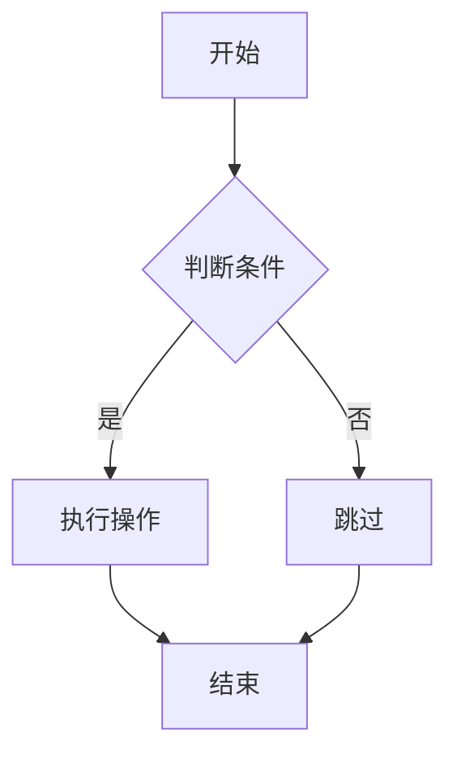
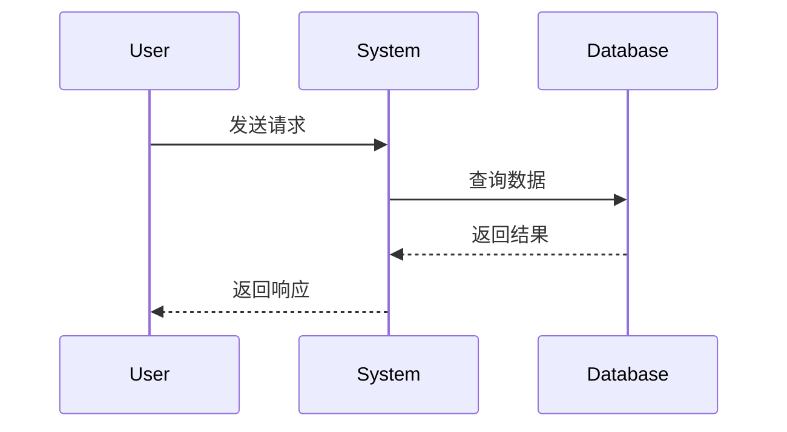
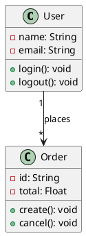

# Technology Guides

本文档提供了各种技术的详细指南，帮助您在润色技术文章时使用正确的术语、示例和最佳实践。

## 数据库技术指南

### Oracle

**核心概念：**
- Performance Views (V$视图)
- PL/SQL 编程
- RAC (Real Application Clusters)
- Data Guard
- Memory Management (SGA, PGA)
- SQL Tuning

**常用视图：**
- `V$SESSION` - 会话信息
- `V$PROCESS` - 进程信息
- `V$LOCK` - 锁信息
- `V$TRANSACTION` - 事务信息
- `V$SQL` - SQL 语句信息
- `V$SQL_PLAN` - 执行计划
- `V$ACTIVE_SESSION_HISTORY` - 活动会话历史
- `DBA_HIST_ACTIVE_SESS_HISTORY` - 历史活动会话

**版本兼容性：**
- Oracle 11g - 基础特性
- Oracle 12c - 多租户架构
- Oracle 19c - 自治数据库
- Oracle 23ai - 向量数据库
- Oracle 26ai - 高级 AI 特性

**常见术语：**
- Buffer Cache - 缓冲区缓存
- Redo Log - 重做日志
- Undo Segment - 撤销段
- MVCC - 多版本并发控制
- Wait Events - 等待事件
- Execution Plan - 执行计划

### MySQL

**核心概念：**
- SQL 查询优化
- InnoDB 存储引擎
- MyISAM 存储引擎
- Replication (主从复制)
- Performance Schema
- 慢查询日志

**常用表/视图：**
- `information_schema` - 信息模式
- `performance_schema` - 性能模式
- `mysql` - 系统数据库
- `sys` - 系统视图

**版本兼容性：**
- MySQL 5.7 - 稳定版本
- MySQL 8.0 - 当前主流版本
- MySQL 8.4 - 最新 LTS 版本

**常见术语：**
- InnoDB Buffer Pool - InnoDB 缓冲池
- Query Cache - 查询缓存（8.0 已移除）
- Binary Log - 二进制日志
- Relay Log - 中继日志
- Slow Query Log - 慢查询日志

### PostgreSQL

**核心概念：**
- SQL 和 PL/pgSQL
- pg_stat 系统视图
- Extensions (扩展)
- WAL (Write-Ahead Logging)
- MVCC (多版本并发控制)
- Logical Replication

**常用视图：**
- `pg_stat_activity` - 活动会话
- `pg_stat_database` - 数据库统计
- `pg_stat_user_tables` - 用户表统计
- `pg_stat_user_indexes` - 用户索引统计
- `pg_locks` - 锁信息

**版本兼容性：**
- PostgreSQL 12 - 稳定版本
- PostgreSQL 13 - 性能优化
- PostgreSQL 14 - 查询优化
- PostgreSQL 15 - 性能提升
- PostgreSQL 16 - 最新版本

**常见术语：**
- Vacuum - 清理死元组
- Autovacuum - 自动清理
- TOAST - 超大字段存储
- CTE (Common Table Expression) - 公用表表达式
- Index-Only Scan - 仅索引扫描

## DevOps 与基础设施指南

### Kubernetes

**核心概念：**
- Pod - 最小部署单元
- Service - 服务发现
- Deployment - 部署管理
- StatefulSet - 有状态应用
- DaemonSet - 守护进程集
- ConfigMap - 配置管理
- Secret - 敏感信息管理
- Ingress - 入口控制器
- HPA (Horizontal Pod Autoscaler) - 水平自动扩缩容

**常用命令：**
```bash
kubectl get pods
kubectl get services
kubectl describe pod <pod-name>
kubectl logs <pod-name>
kubectl apply -f deployment.yaml
kubectl scale deployment <name> --replicas=3
```

**版本兼容性：**
- Kubernetes 1.20+ - 稳定版本
- Kubernetes 1.24+ - 移除 Dockershim
- Kubernetes 1.28+ - 最新稳定版本

**常见术语：**
- Namespace - 命名空间
- Node - 节点
- Cluster - 集群
- Container - 容器
- Image - 镜像
- Volume - 卷
- Persistent Volume - 持久卷
- Helm - 包管理器

### Docker

**核心概念：**
- Container - 容器
- Image - 镜像
- Dockerfile - 镜像构建文件
- Docker Compose - 多容器编排
- Registry - 镜像仓库

**常用命令：**
```bash
docker build -t <image-name> .
docker run -d -p 8080:80 <image-name>
docker ps
docker logs <container-id>
docker exec -it <container-id> /bin/bash
docker-compose up -d
```

**版本兼容性：**
- Docker Engine 20.10+ - 稳定版本
- Docker Compose v2 - 当前版本

**常见术语：**
- Layer - 镜像层
- Volume - 数据卷
- Network - 网络
- Bridge - 桥接网络
- Overlay - 覆盖网络

### Terraform

**核心概念：**
- Infrastructure as Code - 基础设施即代码
- Provider - 提供商
- Resource - 资源
- Module - 模块
- State - 状态文件
- Plan - 执行计划

**常用命令：**
```bash
terraform init
terraform plan
terraform apply
terraform destroy
terraform fmt
terraform validate
```

**版本兼容性：**
- Terraform 1.0+ - 稳定版本
- Terraform 1.5+ - 最新特性

**常见术语：**
- HCL (HashiCorp Configuration Language) - 配置语言
- Backend - 后端存储
- Output - 输出变量
- Variable - 输入变量
- Data Source - 数据源

## AI 与 LLM 指南

### LLM (Large Language Models)

**核心概念：**
- Prompt Engineering - 提示工程
- Context Window - 上下文窗口
- Temperature - 温度参数
- Top-P - 核采样
- Max Tokens - 最大令牌数
- System Prompt - 系统提示
- Few-Shot Learning - 少样本学习
- Chain of Thought - 思维链

**常用模型：**
- GPT-4 - OpenAI
- GPT-3.5 - OpenAI
- Claude - Anthropic
- Llama - Meta
- Mistral - Mistral AI

**API 调用示例：**
```python
response = client.chat.completions.create(
    model="gpt-4",
    messages=[
        {"role": "system", "content": "You are a helpful assistant."},
        {"role": "user", "content": "Hello!"}
    ],
    temperature=0.7,
    max_tokens=1000
)
```

**常见术语：**
- Token - 令牌
- Embedding - 嵌入向量
- Fine-tuning - 微调
- RAG (Retrieval-Augmented Generation) - 检索增强生成
- Hallucination - 幻觉
- Zero-shot - 零样本
- One-shot - 单样本

### RAG (Retrieval-Augmented Generation)

**核心概念：**
- Document Chunking - 文档分块
- Embedding Generation - 嵌入生成
- Vector Database - 向量数据库
- Similarity Search - 相似度搜索
- Re-ranking - 重排序
- Context Window Management - 上下文窗口管理

**常用向量数据库：**
- Pinecone
- Weaviate
- Chroma
- Qdrant
- Milvus

**常见术语：**
- Cosine Similarity - 余弦相似度
- Euclidean Distance - 欧几里得距离
- Dot Product - 点积
- HNSW Index - HNSW 索引
- IVF Index - IVF 索引

## 可视化与文档指南

### Mermaid

**核心概念：**
- Flowchart - 流程图
- Sequence Diagram - 时序图
- Class Diagram - 类图
- State Diagram - 状态图
- Gantt Chart - 甘特图
- Pie Chart - 饼图

**流程图示例：**


**时序图示例：**


**常见术语：**
- Node - 节点
- Edge - 边
- Subgraph - 子图
- Direction - 方向 (TD, LR, BT, RL)

### PlantUML

**核心概念：**
- Use Case Diagram - 用例图
- Class Diagram - 类图
- Sequence Diagram - 时序图
- Activity Diagram - 活动图
- Component Diagram - 组件图
- Deployment Diagram - 部署图

**类图示例：**


**常见术语：**
- Actor - 参与者
- Use Case - 用例
- Association - 关联
- Aggregation - 聚合
- Composition - 组合
- Inheritance - 继承

## 编程语言指南

### Python

**核心概念：**
- 异步编程 (async/await)
- 装饰器
- 上下文管理器
- 生成器
- 列表推导式
- 类型注解

**常用框架：**
- Django - Web 框架
- Flask - 微框架
- FastAPI - 现代 Web 框架
- Pandas - 数据分析
- NumPy - 科学计算
- PyTorch - 深度学习
- TensorFlow - 机器学习

**版本兼容性：**
- Python 3.8+ - 稳定版本
- Python 3.11+ - 性能优化
- Python 3.12+ - 最新版本

**常见术语：**
- Virtual Environment - 虚拟环境
- Package - 包
- Module - 模块
- PIP - 包管理器
- PEP - Python 增强提案

### Java

**核心概念：**
- 面向对象编程
- 多线程
- JVM (Java Virtual Machine)
- Garbage Collection - 垃圾回收
- Stream API - 流式 API
- Lambda 表达式

**常用框架：**
- Spring Boot - Web 框架
- Spring Cloud - 微服务
- Hibernate - ORM
- MyBatis - 持久层框架
- Maven - 构建工具
- Gradle - 构建工具

**版本兼容性：**
- Java 8 - LTS 版本
- Java 11 - LTS 版本
- Java 17 - LTS 版本
- Java 21 - 最新 LTS 版本

**常见术语：**
- JDK - Java 开发工具包
- JRE - Java 运行环境
- JVM - Java 虚拟机
- POJO - 简单 Java 对象
- Bean - Spring Bean

### Go

**核心概念：**
- Goroutine - 协程
- Channel - 通道
- Interface - 接口
- Struct - 结构体
- Defer - 延迟执行
- Error Handling - 错误处理

**常用框架：**
- Gin - Web 框架
- Echo - Web 框架
- gRPC - RPC 框架
- Cobra - CLI 框架
- Viper - 配置管理

**版本兼容性：**
- Go 1.18+ - 泛型支持
- Go 1.21+ - 稳定版本
- Go 1.22+ - 最新版本

**常见术语：**
- Module - 模块
- Package - 包
- GOPATH - Go 路径
- Go Modules - 模块管理
- Goroutine Leak - 协程泄漏

## 最佳实践

### 代码示例格式

所有代码示例都应该：
1. 使用正确的语言标签
2. 包含版本兼容性注释
3. 添加必要的注释说明
4. 遵循该语言的代码风格

### 术语一致性

在同一篇文章中：
- 使用一致的术语翻译
- 首次出现时提供中英文对照
- 后续使用统一的中文或英文术语

### 版本标注

对于版本相关的特性：
- 明确标注适用的版本范围
- 说明版本间的差异
- 提供版本迁移建议

### 错误处理

在示例代码中：
- 展示基本的错误处理
- 说明常见错误类型
- 提供调试建议

## 参考资料

- [Oracle 官方文档](https://docs.oracle.com/)
- [MySQL 官方文档](https://dev.mysql.com/doc/)
- [PostgreSQL 官方文档](https://www.postgresql.org/docs/)
- [Kubernetes 官方文档](https://kubernetes.io/docs/)
- [Docker 官方文档](https://docs.docker.com/)
- [Terraform 官方文档](https://developer.hashicorp.com/terraform/docs)
- [OpenAI API 文档](https://platform.openai.com/docs)
- [Mermaid 官方文档](https://mermaid.js.org/intro/)
- [Python 官方文档](https://docs.python.org/)
- [Java 官方文档](https://docs.oracle.com/en/java/)
- [Go 官方文档](https://go.dev/doc/)
